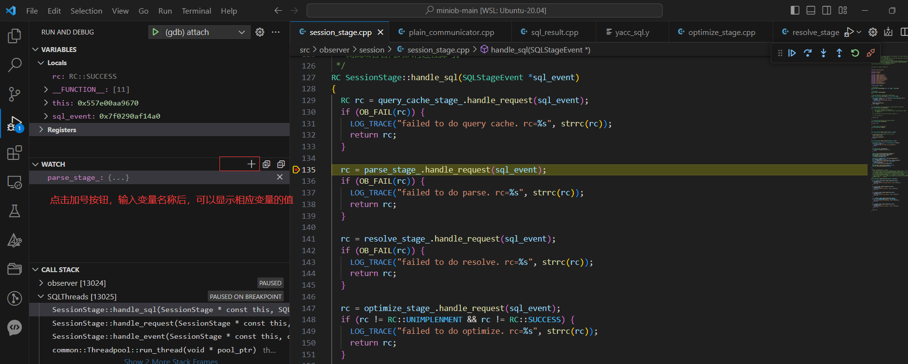

# 调试miniob

# [miniob官方给出了关于调试的文档,可以先浏览一下](https://github.com/luooofan/miniob-2022/wiki/调试miniob#miniob官方给出了关于调试的文档可以先浏览一下)

https://oceanbase.github.io/miniob/dev-env/how_to_dev_miniob_by_vscode.html

# [在WSL中安装c++插件](https://github.com/luooofan/miniob-2022/wiki/调试miniob#在wsl中安装c插件)


# [创建launch.json文件](https://github.com/luooofan/miniob-2022/wiki/调试miniob#创建launchjson文件)

1. 用vscode打开miniob工作目录
2. 在工程目录的.vscode目录下新建tasks.json，鼠标右键.vscode目录，选择新建文件,命名为tasks.json


将以下内容复制到新创建的tasks.json文件中(如果新创建的文件中有内容，就先全部删除掉)。

```
{
    // 使用 IntelliSense 了解相关属性。 
    // 悬停以查看现有属性的描述。
    // 欲了解更多信息，请访问: https://go.microsoft.com/fwlink/?linkid=830387
    "version": "0.2.0",
    "configurations": [
        {
            "name": "(gdb) attach",
            "type": "cppdbg",
            "request": "attach",
            "program": "${workspaceFolder}/build_debug/bin/observer",
            "processId":"${command:pickProcess}",
            "MIMode": "gdb",
            "setupCommands": [
                {
                    "description": "为 gdb 启用整齐打印",
                    "text": "-enable-pretty-printing",
                    "ignoreFailures": true
                },
                {
                    "description":  "将反汇编风格设置为 Intel",
                    "text": "-gdb-set disassembly-flavor intel",
                    "ignoreFailures": true
                }
            ]
        }
    ]
}
```


注意:

- program：该选项指编译出来的可执行文件的路径,本文中路径为"${workspaceFolder}/**build_debug**/bin/observer",之所以于官方文档不同，是因为使用命令**bash build.sh**编译项目时，会生成debug版的miniob，源文件会存储在build_debug目录下。
- request:该选项用于指定调试器连接到正在运行的目标程序的方式。
- "request": "attach" 选项表示调试器将手动连接到正在运行的目标程序，而不是在启动时自动连接。这种方式适用于已经在运行的程序，或者需要手动触发调试器连接的情况。

# [开始调试工作](https://github.com/luooofan/miniob-2022/wiki/调试miniob#开始调试工作)

因为我们选择attach方式进行调试，所以要先编译miniob，并启动它

- 进入工程目录，执行 `bash build.sh`
- 上述build命令会生成build_debug目录,进入该目录，执行命令 `./bin/observer -f ../etc/observer.ini -p 6789`，这会以监听6789端口的方式启动服务端程序。
- 打开一个新的标签页,进入到build_debug,启动客户端程序:`./bin/obclient -p 6789`


启动服务:


启动客户端：


此时，服务器启动成功。

接下来我们调试一下`show tables;`这条sql。

将桌面切换回vscode，可以先将断点打在session_stage.cpp文件的135行处，如下图所示。


点击左侧菜单栏的run and debug(图标为一只虫子)按钮。


接着启动调试，按照下图所示。


点击箭头后会弹出一个窗口，在其中输入 observer，表示我们要attach到observer这个程序上。


之后，如果出现下图中框中的内容，则表示一切顺利.


接下来在客户端输入要调试的sql


程序会命中之前打的断点


下图中是一些说明，大家可以试一试体会一下各个按钮的作用


如何查看当前变量的值呢？




# [常用的gdb命令](https://github.com/luooofan/miniob-2022/wiki/调试miniob#常用的gdb命令)

https://blog.csdn.net/leikezhu1981/article/details/44831999

如何在vscode中使用这些命令呢?

在debug console中,要在命令前添加 -exec 如果我们要使用next命令，则需要在debug console 中输入-exec next


# [调试core文件](https://github.com/luooofan/miniob-2022/wiki/调试miniob#调试core文件)

当程序发生段错误挂掉时（空指针，野指针，堆栈溢出，double free等），系统会生成相应的core文件。core文件就是用来帮助我们找到是哪里发生了段错误的。

首先，我们需要修改一些配置，使得发生段错误时，系统可以为我们生成core文件。

使用vim命令，在家目录下的.bashrc文件中添加一条命令:`ulimit -c unlimited`


在文件的最后一行增加命令`ulimit -c unlimited`


执行 `source .bashrc`命令使修改生效。


core文件位于build_debug目录下，要调试core文件，需要进入到该目录，使用命令 `gdb bin/observer core`


这样我们就可以使用gdb命令来调试core文件了。 可以输入 `bt` 命令，查看当前的调用堆栈，位于调用堆栈最上方的函数，即是发生段错误的位置。