Git是一个开源的分布式版本控制系统，与SVN一类的集中式版本控制工具不同，它采用了分布式版本库的作法，不需要服务器端软件，就可以运作版本控制，使得源代码的发布和交流极其方便。

以下我们基于MiniOB项目简单介绍一下git的使用与操作。

# Git创建仓库
Git仓库可以认为是整个项目存放的远程仓库，它包括项目的源码以及许多分支，关于git的介绍可以参考网上很多资料，这里不过多赘述

假如你是小组的组长，也是项目的管理者，那么Git仓库的创建需要你来进行，创建仓库可以选择很多git平台，这里我们介绍gitee与github两个平台的方式

PS: git 是一种版本控制系统，是一个命令，是一种工具；Github 和 Gitee 等是一个基于git实现在线代码托管的仓库

> 如果参加比赛的话，请参照比赛最新文档选择对应的平台，[大赛手把手入门教程 - MiniOB](https://oceanbase.github.io/miniob/game/gitee-instructions.html#gitee-%E6%8F%90%E6%B5%8B%E6%B5B5%81%E7%A8%8B)

> 网络环境受限的同学可以看后面的gitee部分，在网页端的操作是差不多的

## Github平台教程
首先是创建小组项目仓库，这里直接采用[直接import](https://github.com/new/import)导入miniob仓库的方式，省去新建库并push的过程，可以自行选择创建仓库的权限public\private

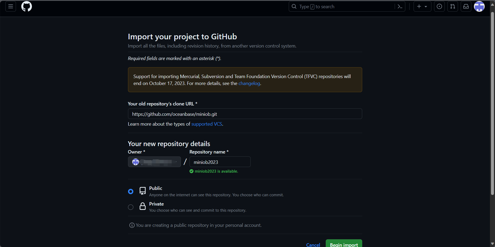

等待片刻，小组仓库就创建好了，需要注意如果仓库是public的情况下，所有人都能查看到小组仓库修改的源码 <br>

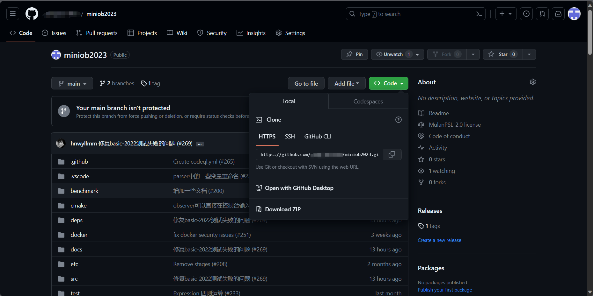

```
# 然后在本地git clone，将远程拷到本地并建立连接
git clone https://github.com/xxx/miniob2023.git
```

git clone将仓库拷贝到本地，这样仓库和本地建立起连接，简单的miniob仓库算是创建好了<br>

注意：github 从2021.8.13开始已经不再支持密码认证，有以下两种方案：
- 可以配置[ssh免密登录](https://docs.github.com/en/authentication/connecting-to-github-with-ssh/adding-a-new-ssh-key-to-your-github-account)，这样clone仓库时需要采用SSH方式`git@github.com:xxx/xxx.git`
- 可以配置 PAT 作为密码，[参考链接](https://docs.github.com/en/authentication/keeping-your-account-and-data-secure/managing-your-personal-access-tokens)；如果多次要求输入用户凭证，可以配置[git凭证缓存](https://git-scm.com/book/en/v2/Git-Tools-Credential-Storage)来解决 

## Gitee平台教程
gitee平台采用import方式创建仓库与github平台流程基本上是类似的，这里不过多赘述，[从 URL 导入 - Gitee.com](https://gitee.com/projects/import/url)

也可以采用新建仓库的方式，参考[gitee官方创建仓库流程](https://oceanbase.github.io/miniob/game/gitee-instructions.html)    
     
这里创建仓库成功后，可以在[miniob比赛官网训练营](https://open.oceanbase.com/train)上尝试提交一次

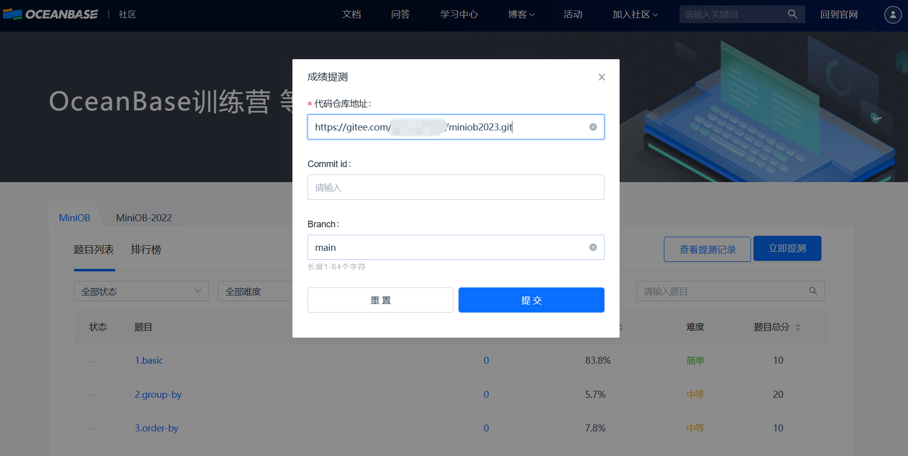

这里仓库选择小组仓库地址，选择需要提交分支即可

现在我们已经创建好我们自己的miniob仓库了，现在我们需要采用git项目管理，让我们的小组成员在这个仓库上分工协作，每个成员完成不同的任务

# Git项目管理
Git项目管理包括项目成员管理、项目群组管理、权限管理等，miniob项目是一个以小组为单位的小型项目，开发成员较少，这里就不过多介绍成员权限管理等等，着重于如何完成小组项目管理，代码冲突管理。
    
在之前我们已经完成仓库的创建，并将miniob项目源码导入到仓库中，可以看到源码位于git仓库中的main分支

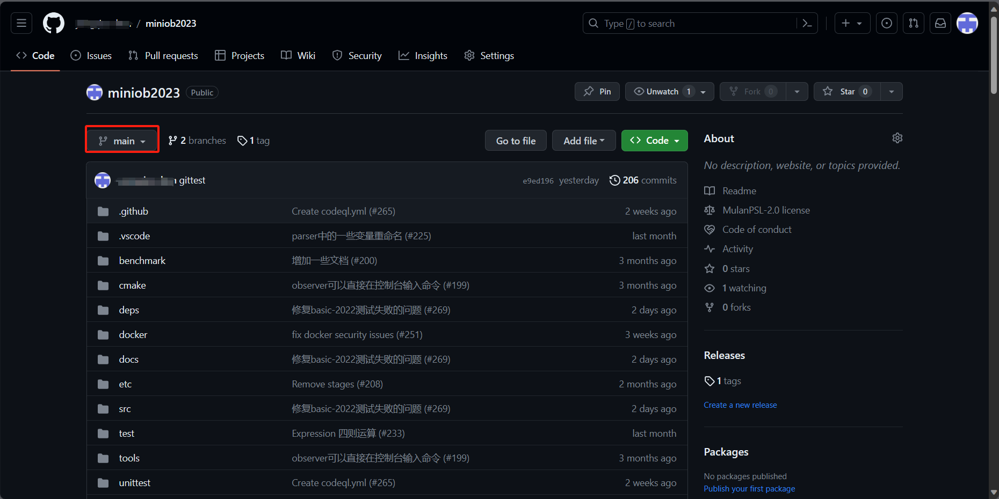

### 项目分支

分支我们可以理解为一个项目任务的生命线，main分支是整个项目的生命线。需要新开发一个项目任务时，可以在main分支的基础上创建新的分支，相当于新建了一个项目任务的生命线，我们可以在这个任务线上不断提交，最终完成这个项目任务时，将这个分支合并回main分支，相当于这个任务已经完成，生命周期已经结束，简单的图示如下。<br>

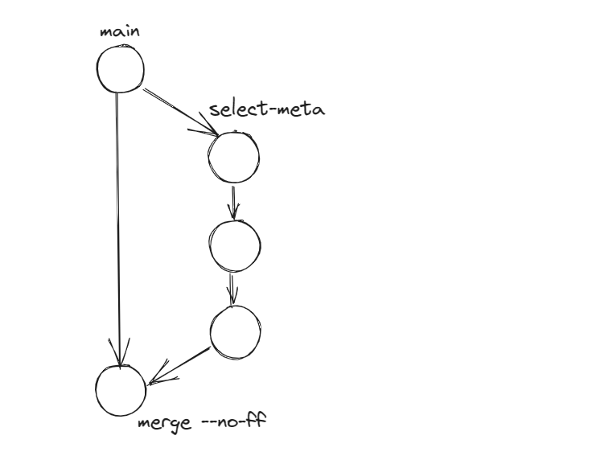

现在我们以miniob项目中新开发一个select-meta的功能，详细介绍git项目的管理 <br>

首先是创建分支
- 可以选择直接本地创建新分支 `git checkout -b select-meta`，然后推送到远程仓库 `git push origin select-meta`
- 也可以先在网页端创建，然后拉取到本地

直接在Github网页上创建远程分支可以参考[github上创建分支](https://docs.github.com/zh/pull-requests/collaborating-with-pull-requests/proposing-changes-to-your-work-with-pull-requests/creating-and-deleting-branches-within-your-repository)

创建完远程分支后，需要更新到自己本地，并指定当前工作区为新创建的select-meta分支

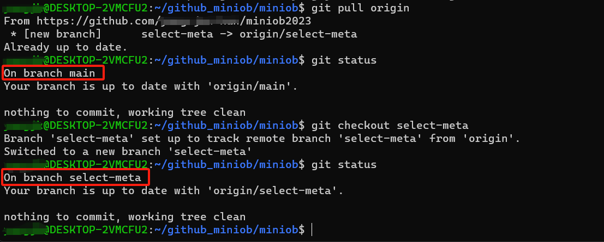

```
git pull origin 
# git pull origin命令是将远程仓库更新到本地仓库，远程仓库中建立了select-meta分支，这里通过pull更新到本地

git status
# git status命令是查看当前工作区位于哪个分支，工作区的概念可以理解为一个工作桌面
# 一个工作桌面上只允许一个任务(也就是分支)的工作开发，如果你想要开发项目的其他任务(select-meta)，需要切换工作区

git checkout select-meta
# git checkout命令可以简单理解为切换当前工作区到某个分支
# checkout之后再git status可以看到，当前本地工作区已经切换到select-meta上
# 此时在本地miniob源码下的修改，就是基于select-meta这个分支下的修改
```


### 本地修改select-meta分支代码，并提交到小组的远程仓库对应select-meta分支中

1. `git pull origin`更新本地版本代码，合并远程最新版本修改

在本地开始修改之间，建议大家养成`git pull`更新本地代码的好习惯，将远程仓库中的修改更新并合并到本地，这样可以避免本地因修改周期过长导致最终提交合并时落后远程版本太多，导致出现冲突的地方增多，难以解决冲突

2. 工作区代码修改

当使用`git checkout`切换到select-meta分支后，我们在miniob项目上的所有修改就是基于select-meta分支上的修改 <br>

前面我们介绍过wsl+vscode的环境搭建，这里我们直接在vscode上进行开发，vscode上自带git工具，在左侧工具栏上如下图标

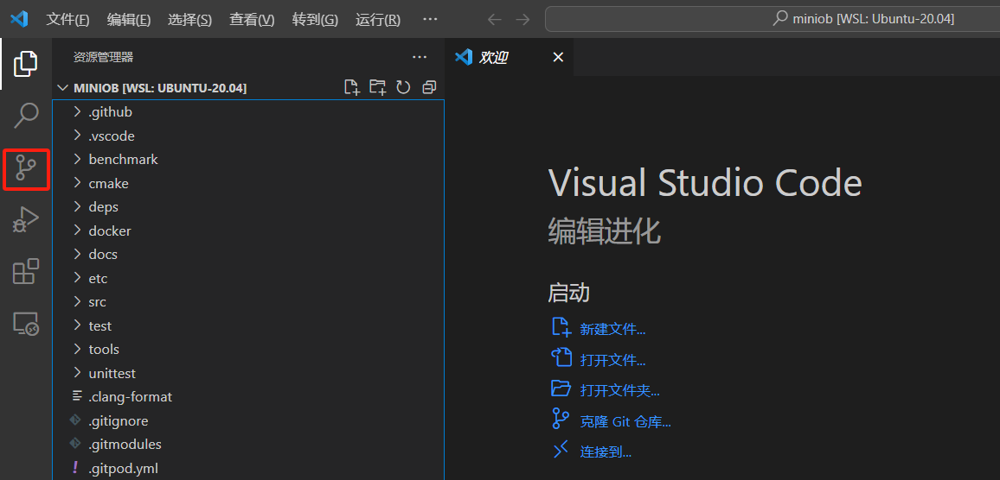

我们在项目中有任何修改，vscode git工具就可以显示我们的修改，这里我简单添加一个示例，查看git工具就可以看到我们当前修改与上一次修改版本的差异

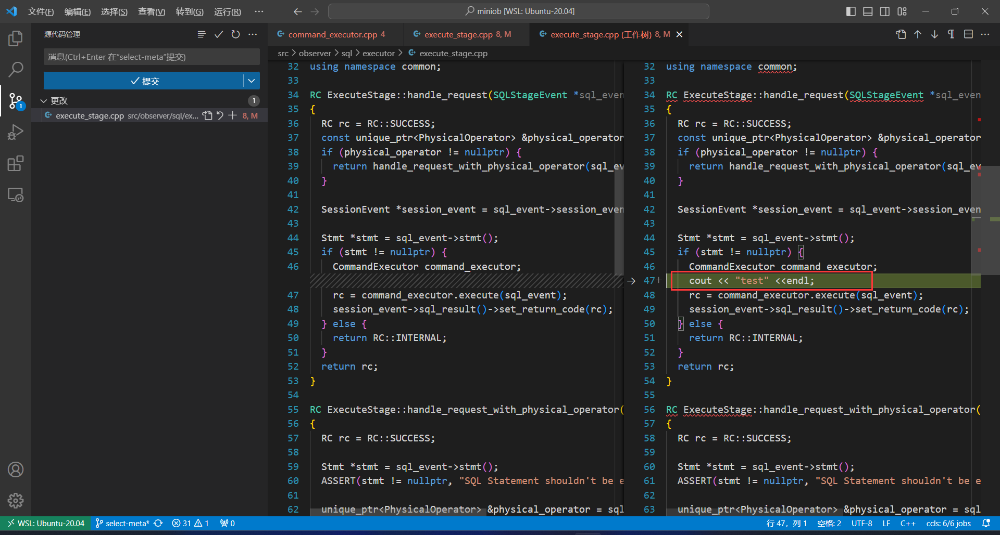

如上例，我们在miniob的源码下修改了execute_stage.cpp文件，添加了一行测试代码，在vscode的git工具中就可以看到修改的文件，并且点开查看，还可以对比当前修改与上个已提交版本修改的差异，如上图左侧与右侧的对比，左侧是上一次已提交的版本，右侧是当前修改的版本。<br>
     
需要注意的是，此时我们的修改仍处于未提交的阶段，当我们完成阶段性的成果后需要将修改的代码进行提交，从未提交的阶段到已提交的阶段。<br>

这里简单介绍一下git提交的阶段<br>

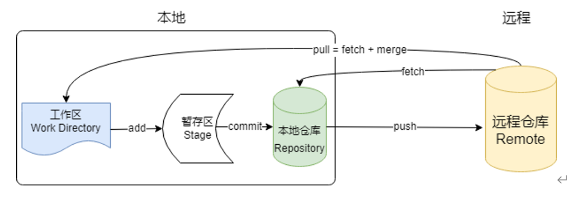

我们刚刚所作的修改其实就是在工作区中，ctrl+s保存也只是保存在工作区中，如果需要提交到一个版本需要经过`git add`暂存区，以及`git commit`提交后，才算真正的在本地提交了一个修改的版本。

3. `git add <file>`添加到暂存区

在vscode git工具中，点击**更改**下的"+"，相当于git add命令，将工作区的修改添加到暂存区中

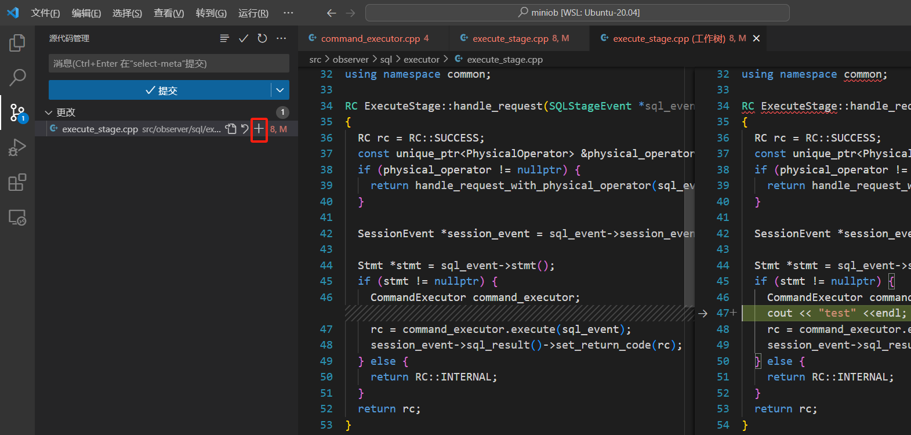

4. `git commit -m "commit message"` 提交到本地一个新版本

-m 参数表示message，当前提交版本所必要的说明，以后需要查看之前某个版本的修改，通过该版本的说明可以大致了解到该版本所做哪些功能与修改   

对应vscode git工具中，上方输入框中即为message参数输入的说明信息

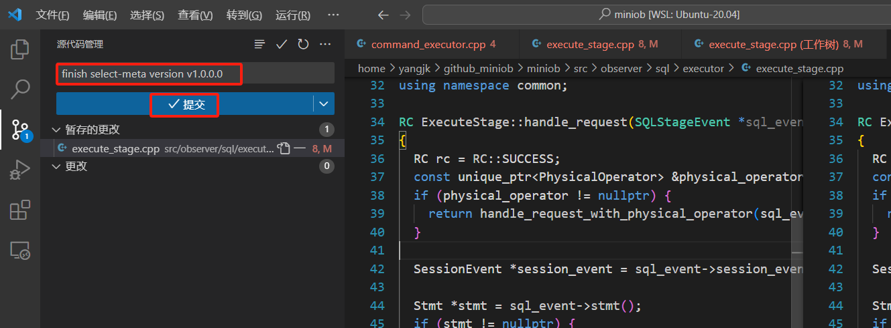

这样，我们就在本地提交了修改的一个新版本，采用`git log`命令可以查看当前git版本状态

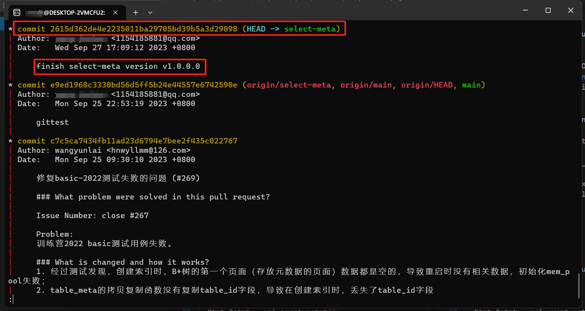

可以看到已提交到本地的新版本的版本号commitID，以及提交时附带的message信息

5. `git push origin <branch>`

`git commit`将修改提交到本地，`git push`命令则是将本地已经commit的修改提交到远程仓库中，`git push origin xxx` 指定xxx分支提交远程仓库   
     
对应vscode git工具中，点击**同步更改**即可将修改push到远程仓库

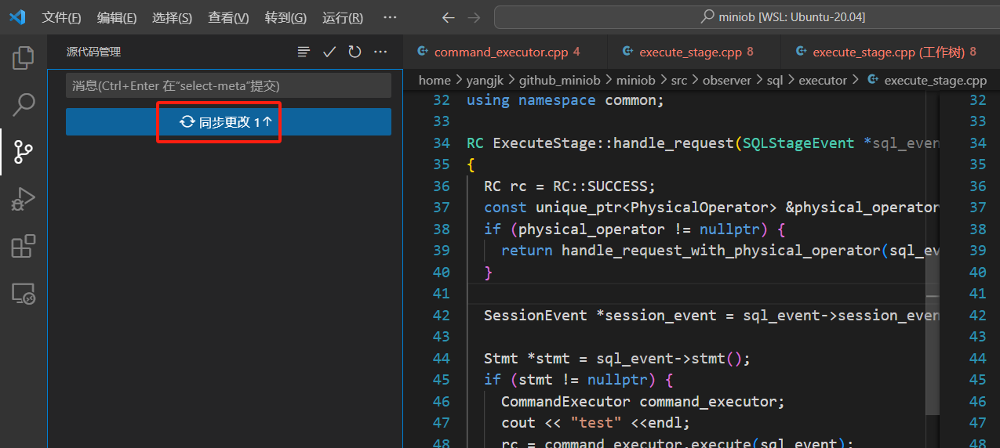

回到github小组仓库中，可以看到select-meta分支已经被修改并提交到仓库中了，对应一个新的commit版本

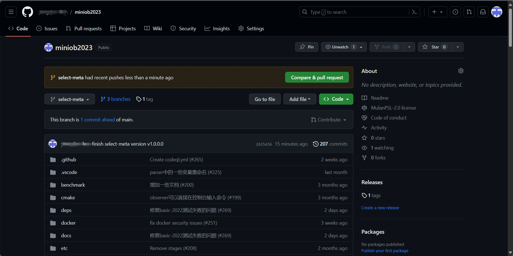

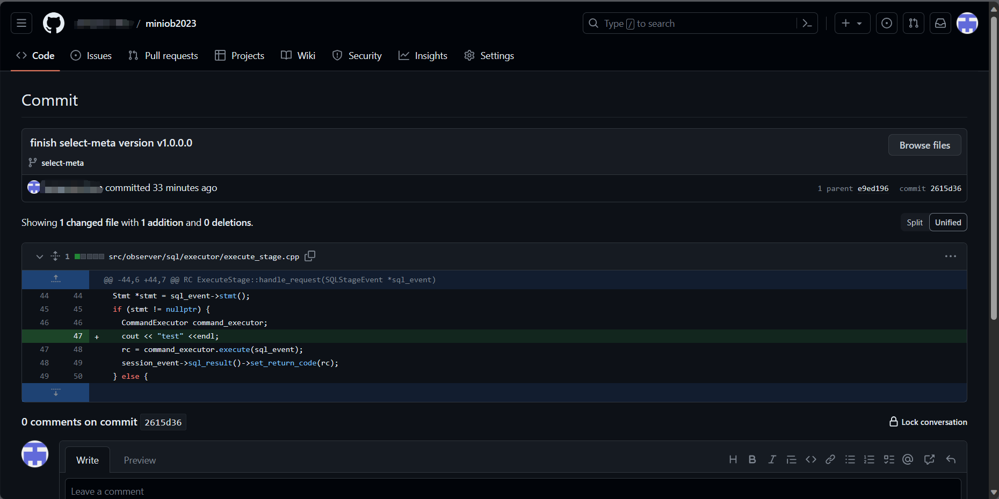

同样我们也可以在github上查看新commit版本与上一个版本之间的差别。最终完成了select-meta功能的开发，并提交到远程select-meta分支上

### 将select-meta功能(分支)合并到主分支main上，迭代一个功能版本的开发

miniob项目需要完成许多个功能模块，现在我们已经完成了第一个功能模块select-meta的开发，此时就可以将这个功能模块(分支)合并到主项目中。剩下所有的功能如索引、update等等都类似于这个步骤，最终主项目完成的功能越来越多，整个项目也在不断推进着。   
     
接下来我们进行select-meta分支的合并，在一个大型的项目中，测试是必不可少的，每完成一个较大的功能模块后，都需要考虑新添加的功能是否会影响到之前的功能，则我们需要将之前其他功能的所有测例都再跑一遍，这是非常消耗时间的一个环节，因为项目越大意味着测试用例也越多。  
       
因此，合并一个功能模块时需要谨慎对待，尽量在检查代码阶段将潜在的问题发现，避免后续回归测试时出现大量问题需要再次测试。因此大型项目中普通开发人员通常不具备合并代码分支的权限，一般是项目的管理者具有合并权限。在合并代码之前，普通开发人员**提交一个合并请求**，然后管理者一般会开一个代码评审会议，让许多人去review新功能的修改代码，如果大家都没意见了，最终由管理者**同意这个合并请求**，将新功能合并到主分支上，从而减少项目Bug的出现。    
     
回到我们select-meta的合并上，github管理合并是采用**提交合并请求Pull requests**完成的，如下图

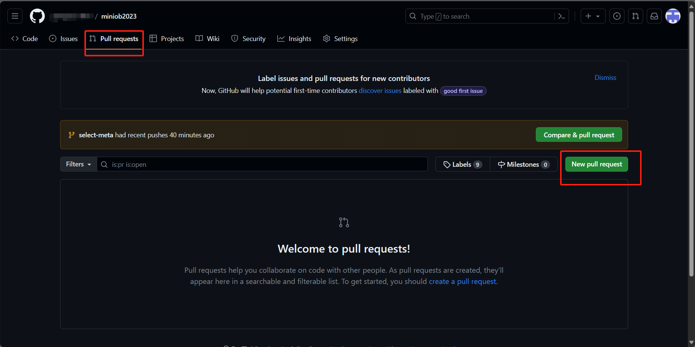

在new pull request之后，选择base分支(main)以及compare分支(select-meta)后，可以看到两个分支之间的差异

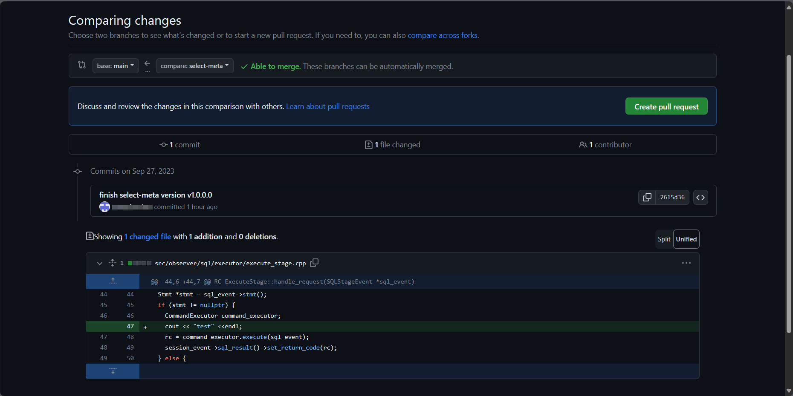

继续点击create pull request，有如下几个关键点：   

1. 左侧write框内需要填写的信息：对当前完成的功能的描述，包括代码功能逻辑，测试报告等等    
2. 右侧指定Reviewer，一般是管理者，reviewer都通过后才允许合并；Assignees，功能模块负责人，负责当前功能的开发等等   

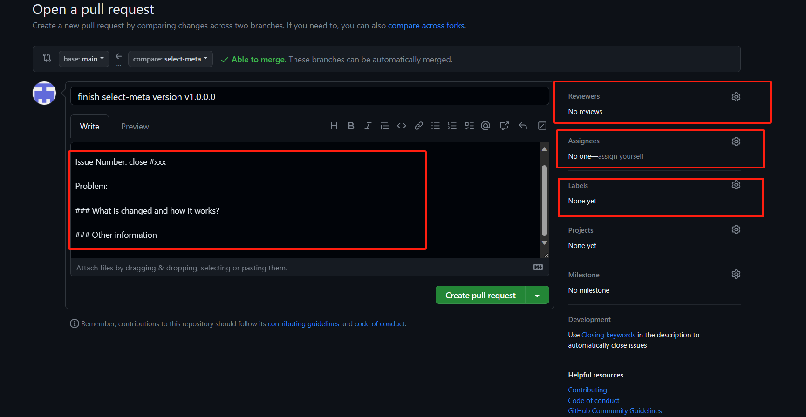

这里由于miniob项目组较小，可以不必过于繁琐，在提交完合并请求pull request后，所有人review一下代码，没问题了直接merge合并即可

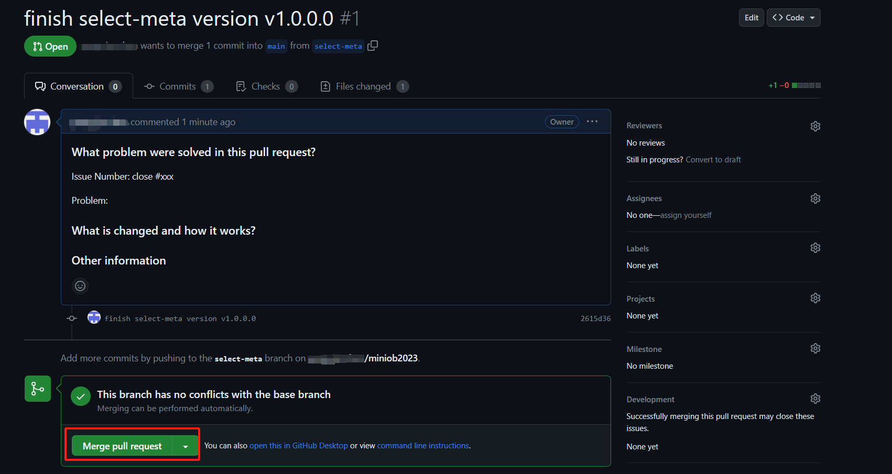

merge完毕后，更新本地并git log查看一下项目结构，可以看到select-meta分支已经被合并到main分支了，正如之前简单介绍的图例一样，我们完成了一个功能的开发，并合并到主项目中，整个git简单的流程大致就是这样了

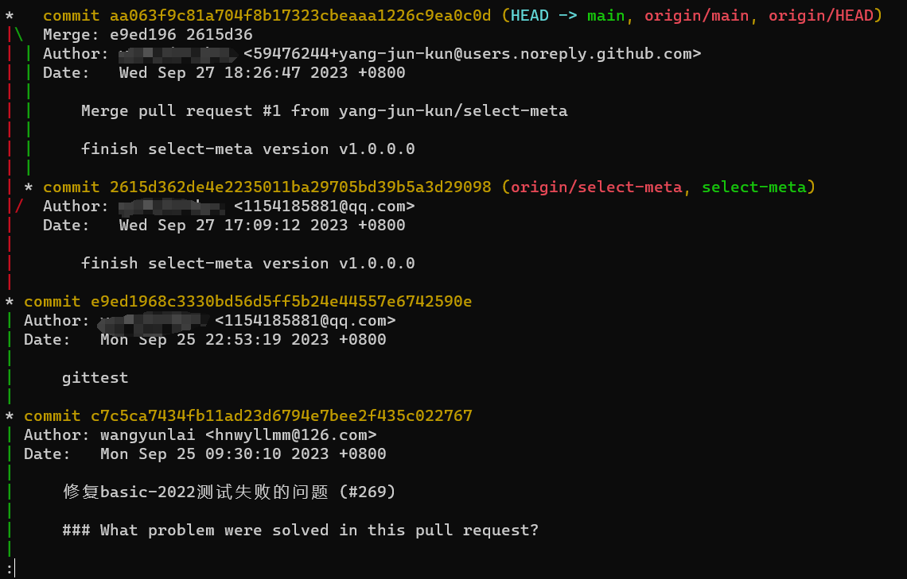

PS：也可以选择本地命令行合并后 `git merge <target-branch>` 直接推送远程

### 协作开发
如果项目中有在同时开发多个功能，那么提交图可能是这样的：

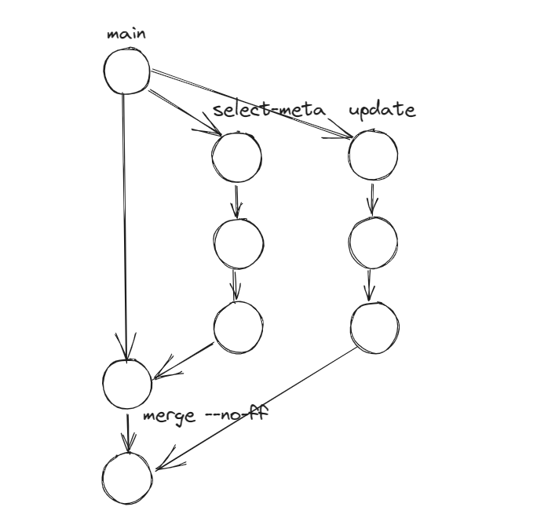

这种情况下在合并时可能会出现冲突

### 合并冲突解决
在git管理的项目组中，合并冲突是无法避免的，同一处代码项目组的其他人都有可能对其进行修改，此时在合并这些同一处修改的commit版本时就会造成冲突

比如使用 `git merge <branch>` 命令合并 test1 分支到 develop 分支时：

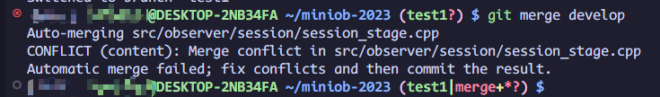

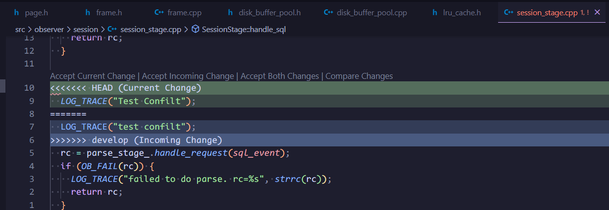

其中介于 <<<<<<< HEAD 和 ======= 之间的内容是代码块A中内容，而介于 ======= 和 >>>>>>> 之间的内容是代码块B中内容    

解决方案：
1. 手动删除A代码块内容，或者手动删除B代码块内容; 或者A和B合并一下代码    
2. 然后把多余的 >>>>> 符号 和 ====== 符号都删光

```
# 解决冲突后 git add将冲突文件提交至暂存区
git add _conflict_file_ 

# git commit提交解决merge冲突之后的结果
git commit -m "solve merge conflict xxx..."

# git push将合并提交至远程仓库
git push
```

解决冲突的方法很简单，重点在于对代码业务逻辑的理解，对代码逻辑熟悉了，与冲突的分支对应的开发者商量讨论一下很容易解决   

### git常用命令
- 常用来查看状态的

```
git status

git log --graph [--oneline] [--all]
```

- 查看当前分支

```
git branch  # 查看本地分支

git branch -a # 查看所有分支，包括远程分支
```

- 创建分支

```
git checkout -b 'your branch name'

git branch -d 'your branch name'  # 删除一个分支
```

- 切换分支

```
git checkout 'branch name'
```

- 提交代码

```
# 添加想要提交的文件或文件夹
git add 'the files or directories you want to commit'
# 这一步也可以用 git add . 添加当前目录

# 提交到本地仓库
# -m 中是提交代码的消息，建议写有意义的信息，方便后面查找
git commit -m 'commit message'
```

- 推送代码到远程仓库

```
git push
# 可以将多次提交，一次性 push 到远程仓库
```

- 合并代码

```
# 假设当前处于分支 develop 下
git merge feature/update
# 会将 feature/update 分支的修改，merge 到 develop 分支
```

- 临时修改另一个分支的代码

```
# 有时候，正在开发一个新功能时，突然来了一个紧急 BUG，这时候需要切换到另一个分  去开发
# 这时可以先把当前的代码提交上去，然后切换分支。
# 或者也可以这样：
git stash # 将当前的修改保存起来

git checkout main # 切换到主分支，或者修复 BUG 的分支

git checkout -b fix/xxx  # 创建一个新分支，用于修复问题

# 修改完成后，merge 到 main 分支
# 然后，继续我们的功能开发

git checkout feature/update # 假设我们最开始就是在这个分支上
git stash pop

# stash 还有很多好玩的功能，大家可以探索一下
```

