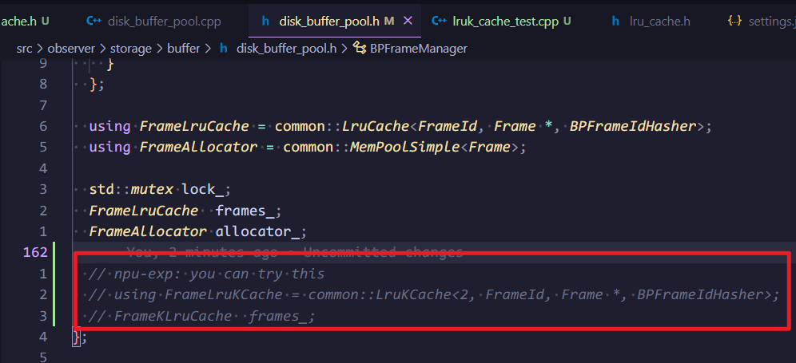

## 引言

同学们对存储器层次结构应该已经很熟悉了：
​

  

图片来源：[CMU 15-445/645 Database Systems (Fall 2023) :: Database Storage I](https://15445.courses.cs.cmu.edu/fall2023/slides/03-storage1.pdf) 
数据来源：[Numbers Every Programmer Should Know By Year](https://colin-scott.github.io/personal_website/research/interactive_latency.html)

由于访问内存和访问磁盘在时延上的巨大差距，我们会更倾向于把要访问到的数据页基于局部性原理尽可能的放在内存中，通常称作缓冲池

缓冲池的大小是有限的，当空间满了，并且需要加载新的数据页到内存中来的时候，需要把缓冲池内的某些数据页置换出去，也就是操作系统课程上学过的页面置换算法：
- FIFO：先入先出。如果一个 page 更早进入缓冲区，那么可以认为在将来它被访问的可能性更小。因此，当空间满时，最先进入缓冲区的 page 最先被淘汰
- LRU：最近最久未使用。如果一个 page 在最近一段时间没有被访问过，那么可以认为在将来它被访问的可能性也很小，因此，当空间满时，最久没有被访问的 page 最先被淘汰。
- LFU：最近最少使用。如果一个 page 在最近一段时间很少被访问到，那么可以认为在将来它被访问的可能性也很小。因此，当空间满时，最小访问频率的 page 最先被淘汰

[Page replacement algorithm - Wikipedia](https://en.wikipedia.org/wiki/Page_replacement_algorithm#Least_recently_used)

在数据库系统中同样有缓冲池，同样要采用缓冲池置换算法，接下来我们看一下 MiniOB 中的缓冲池和 LRU

思考：为什么数据库要维护自己的缓冲池呢？和直接使用操作系统的缓冲机制相比，有什么好处呢？

## MiniOB 中的 LRU
先学习一下官方文档
- [存储实现 - MiniOB](../design/miniob-buffer-pool.md)
- [第2章 数据库的存储结构 - MiniOB](../lectures/lecture-2.md)

### LRU 实现
当前 MiniOB 已经提供了一个 LRU 实现：`deps/common/lang/lru_cache.h`

其内部使用双向链表的方式存储 <key, value> pair，同时维护了一个哈希表以实现 O(1) 的查找开销

对外提供了这些接口：
- get: 根据 key 从 LruCache 中找对应的 value
- put: 在 LruCache 中管理这个 <key, value> pair
- remove: 从 LruCache 中移除指定 key
- count: 返回当前 LruCache 中的节点个数
- foreach: 顺序遍历 LruCahce 中的每一个节点（符合 LRU **逆序**），执行指定的函数，函数返回 false 则中止遍历
- foreach_reverse: 逆序遍历 LruCache 中的每一个链表节点（符合 LRU **顺序**），执行指定的函数，函数返回 false 则中止遍历

### LRU 使用
MiniOB 的缓冲池管理依靠一个全局唯一的 BufferPoolManager，其内部有一个 BPFrameManager，这里面就维护了我们上面提到的 LruCache：`LruCache<FrameId, Frame *, BPFrameIdHasher>`

我们先来看一下这两个组件：

BufferPoolManager 会为每个文件维护一个 DiskBufferPool，同时维护好文件名、打开文件描述符到 DiskBufferPool 的映射

BPFrameManager:
- 管理内存中的页帧。内存是有限的，内存中能够存放的页帧个数也是有限的。
当内存中的页帧不够用时，需要从内存中淘汰一些页帧，以便为新的页帧腾出空间，使用 LRU 策略
- 这个管理器负责为所有的 BufferPool 提供页帧管理服务，也就是所有的 BufferPool 磁盘文件在访问时都使用这个管理器映射到内存。

那上层是如何操作它们的呢？
- 上层会操作 BufferPoolManager 或者 DiskBufferPool
- 上层有一个 Table 的接口，封装了 create_table、drop_table、insert_record、update_record、delete_record、get_record 等操作

结合前面的实验教程，那我们现在就清楚了：
- 用户在 client 输入一条 sql 语句，通过网络传输到 server
- 经过词语法解析、语义解析、逻辑计划生成、重写优化、物理计划生成后
- 在执行物理计划的过程中，会调用到 Table 的各个接口
- 这个时候要读写磁盘文件，触及到了缓冲区管理，使用了 LRU 替换策略

现在我们回到 LruCache，还有两个问题：

- LruCache 中的所有 frame 都可以被置换吗？ 
  对于那些正在被使用的 frame，我们是不能把它置换出去的，那我们在使用 frame 的时候就要 pin，不再使用这个 frame 的时候就要 unpin
- 什么时候会触发置换呢？ 
  DiskBufferPool::allocate_frame -> BPFrameManager::purge_frames: 按 LRU 序找到一定数量的能够 purge 的 frames

接下来我们来看几个常见的流程是如何操作缓冲区的：
​

  

从图中可以看出：
- 增删改查操作都会按序走：[事务接口 ->] Table 接口 -> RecordFileHandler 接口 -> RecordPageHandler 接口
- 对缓冲区的操作主要集中在 `RecordPageHandler::init` 函数中，因为无论是增删改查哪个操作，都需要先定位到某个 page，“加载”到缓冲区中（可能已经在缓冲区中了），pin frame，然后再对其进行操作，如果写了这个 page，还要把它标记成脏页 dirty frame，操作完之后要 unpin frame
- 当插入 record 时，若发现没有可用的 page（根据 header frame 即可快速确定），这个时候需要分配一个新的 page 并加载到缓冲区 `DiskBufferPool::allocate_page`，如果此时缓冲区是满的，那么就需要按照 LRU 序选出一个可以被丢出缓冲区的 page，如果是脏页需要刷盘，然后把新分配的 page 放到缓冲区中

上面有两个概念，page 和 frame，page 是磁盘上存储的物理数据，frame 是内存中缓冲区内对 page 的包装，缓冲区为了管理 page，需要在 frame 中维护一些信息，比如：dirty flag，pin count 等

除了增删改查操作外，还有一些操作，比如 create table，drop table，服务的停止、重启等，这里列出 create 和重启动时的简要流程图，其他的流程同学们自行探索
​

  

## LRU-K
### LRU 缺点
缓存污染：
偶发性的、周期性的批量操作会使得热点数据被非热点数据挤出缓存，导致缓存命中率急剧下降，这时候缓存中的数据大部分都不是热点数据，受到了污染

对应到数据库中，当我们要对一张大数据量的表做表扫描操作时，比如 `select * from t1;`，缓冲区的原有数据页会被大量置换为 t1 的数据页，但是 t1 的数据页访问一次过后就不需要再访问了，导致了缓存污染

### LRU-K 介绍

LRU-K 中的 K 代表最近的第 K 次访问（也就是之前的第 K 次访问，K-th most recent access，K-th previous access），LRU-1 就是 LRU。LRU-K 的主要目的是为了解决 LRU 算法缓存污染的问题，其核心思想是将 **最近 1 次的访问时间** 的判断标准扩展为 **最近的第 K 次的访问时间**

LRU-K 算法在需要置换的时候，会驱逐出具有最大 backward k-distance 的数据页。每个数据页的 backward k-distance 是它的 **前第 K 次访问时间** 和 **当前时间** 的差值

对于访问次数没有达到 K 次的数据页，它的 backward k-distance 被视作是正无穷，也就是说会更早被置换。当存在多个这样的数据页时，我们可以采用某种置换算法进行淘汰，比如 LRU，FIFO 等

LRU-K 相比于 LRU，极大的改善了时间局部性，使得缓存数据更不容易被替换，而且偶发性的数据不易被缓存。在保证了缓存数据纯净的同时提高了热点数据命中率

论文：[The LRU-K page replacement algorithm for database disk buffering | Proceedings of the 1993 ACM SIGMOD international conference on Management of data](https://dl.acm.org/doi/10.1145/170035.170081)

## 实验：实现 LRU-K

### 实验要求
实现 LRU-K，对于访问次数不够 K 次的数据页，我们采用 LRU 置换算法

接口已经给定，同学们需要在 `deps/common/lang/lruk_cache.h` 文件中实现：
- destroy：销毁 LruKCache，释放资源
- get：根据 key 从 LruKCache 中找对应的 value
- put：LruKCache 中已经存在则更新，不存在则新增 <k, v>
- remove：从 LruKCache 中移除指定 key
- count：返回当前 LruKCache 中的节点个数
- foreach：遍历 LruKCahce 中的每一个节点（**任何顺序均可**），执行指定的函数，函数返回 false 则中止遍历
- foreach_reverse：遍历 LruKCache 中的每一个节点（**符合 LRU-K 顺序**），执行指定的函数，函数返回 false 则中止遍历

NOTE：LruKCache 模板声明以及 public 方法声明不允许更改，内部的数据结构和 private 方法同学们可以任意更改

思考：看看 LruCache 的各个接口是如何被使用的，换成 LruKCache 之后，对接口的定义有没有什么想法？

### 本地测试
本地提供了两个基本的单元测试用例： `unittest/lruk_cache_test.cpp`

可以在编译后执行： `cd build && ./bin/lruk_cache_test` 进行测试
​

  

如果实现正确的话，会显示通过这两个测试

同学们可以自己添加更多的用例，也可以在 `src/observer/storage/buffer/disk_buffer_pool.h` 中启用写好的 LruKCache
​

  

### 成果提交
待定
- 代码：只需要该文件即可 `deps/common/lang/lruk_cache.h` 
- 文档：实现思路，以及上文中有两个思考题

## 其他
感兴趣的同学可以看看 MySQL 8.0 中的缓冲区替换策略：
- [MySQL :: MySQL 8.0 Reference Manual :: 15.5.1 Buffer Pool](https://dev.mysql.com/doc/refman/8.0/en/innodb-buffer-pool.html)

力扣练手题：
- [146. LRU 缓存 - 力扣（LeetCode）](https://leetcode.cn/problems/lru-cache/)
- [460. LFU 缓存 - 力扣（LeetCode）](https://leetcode.cn/problems/lfu-cache/)