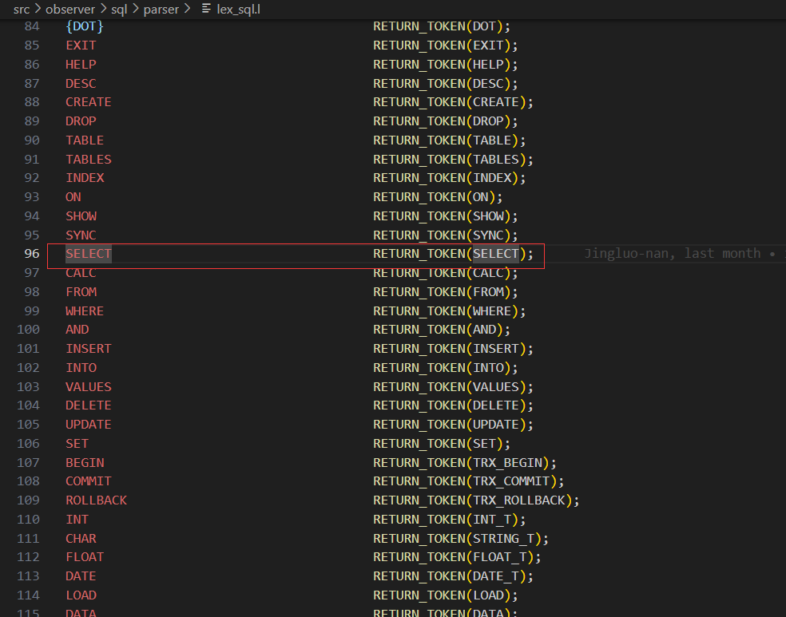
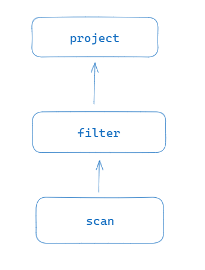
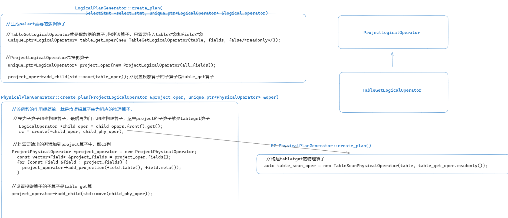
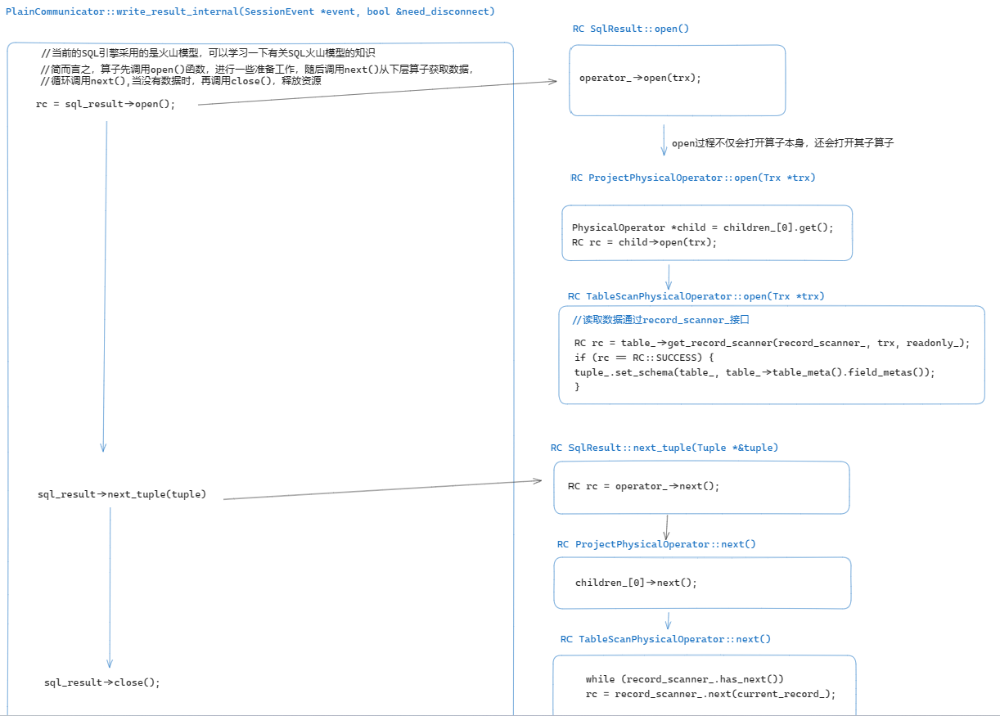

# SELECT 语句执行流程解析

本文将会详细介绍 MiniOB 中 SELECT 语句的执行流程，接下来将以 `select c1 from t1` 为例进行讲解

`create table t1 (c1 int);`

`select c1 from t1;`

## 一. SQL 语句执行流程

MiniOB 的 SQL 语句执行流程如下图所示：
​<p align=center>
  
</p>

左侧是执行流程节点，右侧是各个执行节点输出的数据结构。

1. 我们收到了一个 SQL 请求，此请求以字符串形式存储;
2. 在 Parser 阶段将 SQL 字符串，通过词法解析 (lex_sql.l) 与语法解析 (yacc_sql.y) 解析成 `ParsedSqlNode` (parse_defs.h);
3. 在 Resolver 阶段，将 `ParsedSqlNode` 转换成 `Stmt` (全称 Statement，参考 stmt.h);
4. 在 Transformer 和 Optimizer 阶段，将 Stmt 转换成 `LogicalOperator`，优化后输出 `PhysicalOperator` (参考 optimize_stage.cpp)。如果是命令执行类型的 SQL 请求，会创建对应的 `CommandExecutor` (参考 command_executor.cpp);
5. 最终执行阶段 Executor，工作量比较少，将 `PhysicalOperator` (物理执行计划)转换为 `SqlResult` (执行结果)，或者将 `CommandExecutor` 执行后通过 SqlResult 输出结果。

现在不明白这些过程没有关系，接下来会具体分析每一个过程

## 二. 一条 sql 语句的一生

我们学习一条 sql 的执行流程，可以从函数 `SessionStage::handle_request(StageEvent *event)` 看起

```c++
void SessionStage::handle_request(StageEvent *event)
{
  ...
  (void)handle_sql(&sql_event);
  ...
  RC rc = communicator->write_result(sev, need_disconnect);
  ...
}
```

在上述函数中，我们只需要关注以上两行代码

```c++
RC SessionStage::handle_sql(SQLStageEvent *sql_event)
{
  // 计划缓存阶段目前未实现，直接返回成功
  RC rc = query_cache_stage_.handle_request(sql_event);
  // 对 sql 语句词法语法解析生成语法树 sql_node(ParsedSqlNode)，设置到 sql_event 中
  rc = parse_stage_.handle_request(sql_event);
  // 根据上一阶段生成的 sql_node，生成对应的 stmt，比如 SelectStmt CreateTableStmt 等，设置到 sql_event 中
  rc = resolve_stage_.handle_request(sql_event);
  // 根据 stmt 生成逻辑计划树 LogicalOperator，经过重写和优化后生成物理计划树 PhysicalOperator，设置到 sql_event 中
  rc = optimize_stage_.handle_request(sql_event);
  // 根据前面生成的物理计划树 PhysicalOperator 或者 stmt，进行具体的执行流程
  rc = execute_stage_.handle_request(sql_event);
  return rc;
}
```

可以发现，整个 sql 语句的处理流程可以划分为：
- parse 词语法解析
- resolve 语义解析
- optimize 逻辑计划树 重写 优化 物理计划树
- execute 执行

其中每个阶段产生的生成物，语法树、stmt、物理计划树，会通过 `SQLStageEvent *sql_event` 进行传递

我们可以看一下这个类的成员变量：

```c++
class SQLStageEvent : public common::StageEvent
{
  SessionEvent *session_event_ = nullptr;
  std::string sql_;  ///< 处理的SQL语句
  std::unique_ptr<ParsedSqlNode> sql_node_;  ///< 语法解析后的SQL命令
  Stmt *stmt_ = nullptr;  ///< Resolver之后生成的数据结构
  std::unique_ptr<PhysicalOperator> operator_; ///< 生成的执行计划，也可能没有
}
```

接下来会分别讲解以上四个阶段

## 三. parse 词法语法解析阶段
函数：`parse_stage_.handle_request()`

词法分析与语法分析是编译原理中的相关知识，在 MiniOB 中，词法文件是 lex_sql.l，语法文件是 yacc_sql.y，同学们可以先学习一下官方的文档
[SQL Parser - MiniOB](https://db-npu.github.io/miniob/design/miniob-sql-parser.html)

- 在词法分析阶段，会将输入的 sql 语句分解为一个个 token，传递给语法分析器；如下图，flex 会将 `SELECT` 字符串（忽略大小写）识别为 token `SELECT` 传递给 yacc/bison

  

- 在语法分析阶段，会根据语法文件，对词法分析生成的 token 进行归约，生成相应的 sql node

  针对 `select c1 from t1` 这条 sql 语句，对应的是如下的语法规则（文件yacc_sql.y中）：

  ```yacc
  select_stmt:        /*  select 语句的语法解析树*/
    SELECT select_attr FROM ID rel_list where
    {
      $$ = new ParsedSqlNode(SCF_SELECT);
      if ($2 != nullptr) {
        $$->selection.attributes.swap(*$2);
        delete $2;
      }
      if ($5 != nullptr) {
        $$->selection.relations.swap(*$5);
        delete $5;
      }
      $$->selection.relations.push_back($4);
      std::reverse($$->selection.relations.begin(), $$->selection.relations.end());
      if ($6 != nullptr) {
        $$->selection.conditions.swap(*$6);
        delete $6;
      }
      free($4);
    }
    ;
  ```

​对于 `select c1 from t1` 这条 sql，以上语法规则中：
- `SELECT` 对应于 `select`
- `select_attr` 对应于 `c1`
- `FROM` 对应于 `from`
- `ID` 对应于 `t1`
- rel_list 与 where 本 sql 中没有涉及

经过语法解析后（也就是刚刚语法规则大括号里面的那段代码），select 语句中的内容会存储到一个 `SelectSqlNode` 结构体中

我们来看一下这个结构体的成员变量

```c++
struct SelectSqlNode
{
  std::vector<RelAttrSqlNode>     attributes;    ///< attributes in select clause
  std::vector<std::string>        relations;     ///< 查询的表
  std::vector<ConditionSqlNode>   conditions;    ///< 查询条件，使用AND串联起来多个条件
};
```

​对于 `select c1 from t1` 这条 sql：
- attributes 中存储了列 `c1`
- relation 中存储了表名 `t1`
- conditions 中存储的是 where 后的过滤条件，本 sql 中没有 where 子句，所以 conditions 中内容为空

我们来看一下 attributes 具体是如何存储的

```c++
struct RelAttrSqlNode
{
  std::string relation_name;   ///< relation name (may be NULL) 表名
  std::string attribute_name;  ///< attribute name              属性名
};
```

可以看到，用来存储投影字段的数据结构 `RelAttrSqlNode`，其实就是保存了表名的字符串和列名的字符串

到此，词法语法解析的过程就结束了

## 四. resolve 语义解析阶段
函数：`resolve_stage_.handle_request()`

```c++
RC ResolveStage::handle_request(SQLStageEvent *sql_event)
{
  ...
  ParsedSqlNode *sql_node = sql_event->sql_node().get();
  Stmt *stmt = nullptr;
  rc = Stmt::create_stmt(db, *sql_node, stmt);
  ...
  sql_event->set_stmt(stmt);
  return rc;
}
```

该函数中，最重要的是 `Stmt::create_stmt(db, *sql_node, stmt)` 该函数根据词法语法解析生成的 sql node，生成对应的 stmt

```c++
RC Stmt::create_stmt(Db *db, ParsedSqlNode &sql_node, Stmt *&stmt)
{
  stmt = nullptr;

  switch (sql_node.flag) {
    case SCF_INSERT: {
      return InsertStmt::create(db, sql_node.insertion, stmt);
    }
    case SCF_DELETE: {
      return DeleteStmt::create(db, sql_node.deletion, stmt);
    }
    case SCF_SELECT: {
      return SelectStmt::create(db, sql_node.selection, stmt);
    }
  	....
    default: {
      LOG_INFO("Command::type %d doesn't need to create statement.", sql_node.flag);
    } break;
  }
  return RC::UNIMPLENMENT;
}
```

`sql_node.flag` 表示本语句的类型，针对 select 语句，会调用 `SelectStmt::create(db, sql_node.selection, stmt)`，根据语法树 sql node，生成 stmt

在语法解析阶段，我们只能检查sql语句是否有语法错误，而在语义解析阶段中，**我们要检查 select 语句中出现的表名，列名等是否存在**

```c++
RC SelectStmt::create(Db *db, const SelectSqlNode &select_sql, Stmt *&stmt)
{
  // collect tables in `from` statement
  std::vector<Table *> tables;//存储from后跟的表,本sql中就表示表t1
  std::unordered_map<std::string, Table *> table_map;
  for (size_t i = 0; i < select_sql.relations.size(); i++) {
    const char *table_name = select_sql.relations[i].c_str();
    Table *table = db->find_table(table_name);//根据表的名字，获取相关的Table
    if (nullptr == table) {
      LOG_WARN("no such table. db=%s, table_name=%s", db->name(), table_name);
      return RC::SCHEMA_TABLE_NOT_EXIST;
    }

    tables.push_back(table);
    table_map.insert(std::pair<std::string, Table *>(table_name, table));//存储表名到Table的映射
  }

  // collect query fields in `select` statement
  std::vector<Field> query_fields;//存储select后跟的列,本sql中就表示c1列
  for (int i = static_cast<int>(select_sql.attributes.size()) - 1; i >= 0; i--) {
    const RelAttrSqlNode &relation_attr = select_sql.attributes[i];

    if (common::is_blank(relation_attr.relation_name.c_str()) &&
        0 == strcmp(relation_attr.attribute_name.c_str(), "*")) {//像select * from t1;这种sql，就需要把 * 转换为列名
      for (Table *table : tables) {
        wildcard_fields(table, query_fields);
      }

    } else if (!common::is_blank(relation_attr.relation_name.c_str())) {
      const char *table_name = relation_attr.relation_name.c_str();
      const char *field_name = relation_attr.attribute_name.c_str();
		...
   
        for (Table *table : tables) {
          wildcard_fields(table, query_fields);
        }
      } else {
        auto iter = table_map.find(table_name);
        if (iter == table_map.end()) {
          LOG_WARN("no such table in from list: %s", table_name);
          return RC::SCHEMA_FIELD_MISSING;
        }

        Table *table = iter->second;
        if (0 == strcmp(field_name, "*")) {
          wildcard_fields(table, query_fields);
        } else {
          const FieldMeta *field_meta = table->table_meta().field(field_name);
          if (nullptr == field_meta) {
            LOG_WARN("no such field. field=%s.%s.%s", db->name(), table->name(), field_name);
            return RC::SCHEMA_FIELD_MISSING;
          }

          query_fields.push_back(Field(table, field_meta));
        }
      }
    } else {
      if (tables.size() != 1) {
        LOG_WARN("invalid. I do not know the attr's table. attr=%s", relation_attr.attribute_name.c_str());
        return RC::SCHEMA_FIELD_MISSING;
      }

      Table *table = tables[0];
      const FieldMeta *field_meta = table->table_meta().field(relation_attr.attribute_name.c_str());
      if (nullptr == field_meta) {
        LOG_WARN("no such field. field=%s.%s.%s", db->name(), table->name(), relation_attr.attribute_name.c_str());
        return RC::SCHEMA_FIELD_MISSING;
      }

      query_fields.push_back(Field(table, field_meta));
    }
  }


  Table *default_table = nullptr;
  if (tables.size() == 1) {
    default_table = tables[0];
  }

  // create filter statement in `where` statement
  FilterStmt *filter_stmt = nullptr;//针对where后的过滤条件
  RC rc = FilterStmt::create(db,
      default_table,
      &table_map,
      select_sql.conditions.data(),
      static_cast<int>(select_sql.conditions.size()),
      filter_stmt);
  if (rc != RC::SUCCESS) {
    LOG_WARN("cannot construct filter stmt");
    return rc;
  }

  SelectStmt *select_stmt = new SelectStmt();
  select_stmt->tables_.swap(tables);
  select_stmt->query_fields_.swap(query_fields);
  select_stmt->filter_stmt_ = filter_stmt;
  stmt = select_stmt;
  return RC::SUCCESS;
}
```

到目前为止，我们已经将词法语法解析生成的 `sql_node`，转换为了 `SelectStmt`

## 五. optimize 优化阶段
函数：`optimize_stage_.handle_request()`

```c++
RC OptimizeStage::handle_request(SQLStageEvent *sql_event)
{
  RC rc = create_logical_plan(sql_event, logical_operator);//生成逻辑算子
  ... // rewrite optimize
  rc = generate_physical_plan(logical_operator, physical_operator);//生成物理算子
  return rc;
}
```

该函数中，最重要的就是以上两行代码，什么是算子呢？SQL 语句的具体执行过程，可以根据 SQL 语句的不同分成不同的执行步骤，每个步骤中通常都会包含一个或多个 SQL 算子。算子之间以树状形式进行组织。MiniOB 中 sql 执行的引擎，采用火山模型

在火山模型中，所有的代数运算符(operator)都被看成是一个迭代器，它们都提供一组简单的接口：open()->next()->close()，执行计划树由一个个这样的关系运算符组成，每一次的 next() 调用，运算符就返回一行(Row)，每一个运算符的 next() 都有自己的流控逻辑，数据通过运算符自上而下的 next() 嵌套调用而被动的进行拉取

<p align="center">
  
</p>

简单 select 语句的语法树如上图所示：
- scan 算子负责将数据从磁盘中读出来
- filter 算子负责过滤掉一些不符合条件的数据行
- project 算子负责投影操作，也会涉及到表达式计算
 
```c++
RC LogicalPlanGenerator::create_plan(
    SelectStmt *select_stmt, unique_ptr<LogicalOperator> &logical_operator)
{
  unique_ptr<LogicalOperator> table_oper(nullptr);

  const std::vector<Table *> &tables = select_stmt->tables();
  const std::vector<Field> &all_fields = select_stmt->query_fields();
  for (Table *table : tables) {
    std::vector<Field> fields;
    for (const Field &field : all_fields) {
      if (0 == strcmp(field.table_name(), table->name())) {
        fields.push_back(field);
      }
    }

    unique_ptr<LogicalOperator> table_get_oper(new TableGetLogicalOperator(table, fields, true/*readonly*/));//针对每一张表，都要生成一个TableGetLogicalOperator算子
    if (table_oper == nullptr) {
      table_oper = std::move(table_get_oper);
    } else {
      JoinLogicalOperator *join_oper = new JoinLogicalOperator;
      join_oper->add_child(std::move(table_oper));
      join_oper->add_child(std::move(table_get_oper));
      table_oper = unique_ptr<LogicalOperator>(join_oper);
    }
  }

  unique_ptr<LogicalOperator> predicate_oper;//filter算子，进行数据行的过滤
  RC rc = create_plan(select_stmt->filter_stmt(), predicate_oper);
  if (rc != RC::SUCCESS) {
    LOG_WARN("failed to create predicate logical plan. rc=%s", strrc(rc));
    return rc;
  }

  unique_ptr<LogicalOperator> project_oper(new ProjectLogicalOperator(all_fields));
  if (predicate_oper) {
    if (table_oper) {
      predicate_oper->add_child(std::move(table_oper));
    }
    project_oper->add_child(std::move(predicate_oper));
  } else {
    if (table_oper) {
      project_oper->add_child(std::move(table_oper));//设置子算子
    }
  }

  logical_operator.swap(project_oper);
  return RC::SUCCESS;
}
```

算子之间通过 `add_child` 函数组织成树的形式

而 `generate_physical_plan` 函数，就是将逻辑算子转换为物理算子


<p align=center>
  
</p>

## 六. execute 执行阶段
函数：`execute_stage_.handle_request(sql_event)`

经过以上的阶段，我们已经生成了 sql 语句相应的算子树，接下来就是对算子进行 open(),next(),close() 等操作。

首先调用顶层算子的 `open` 函数，而在算子的 `open` 函数中，还会递归的调用子算子的 `open` 函数。同理，在算子的 `next` 函数中，也会递归的调用子算子的 `next` 函数。

```c++
RC SqlResult::open()
{
  if (nullptr == operator_) {
    return RC::INVALID_ARGUMENT;
  }

  Trx *trx = session_->current_trx();
  trx->start_if_need();
  return operator_->open(trx); // 调用子算子的 open 函数
}
```

让我们回到最开始的时候:

```c++
void SessionStage::handle_request(StageEvent *event)
{
  ...
  (void)handle_sql(&sql_event);
  ...
  RC rc = communicator->write_result(sev, need_disconnect);
  ...
}
```

`(void)handle_sql(&sql_event);` 负责生成相应的算子树， `communicator->write_result` 负责打开算子树，执行相应流程，获取查询结果并返回给客户端

```c++
RC PlainCommunicator::write_result(SessionEvent *event, bool &need_disconnect)
{
  RC rc = write_result_internal(event, need_disconnect);
  ...
  return rc;
}
```

```c++
RC PlainCommunicator::write_result_internal(SessionEvent *event, bool &need_disconnect)
{
  RC rc = RC::SUCCESS;
  need_disconnect = true;

  SqlResult *sql_result = event->sql_result();
  rc = sql_result->open();//打开顶层算子
  if (OB_FAIL(rc)) {
    sql_result->close();
    sql_result->set_return_code(rc);
    return write_state(event, need_disconnect);
  }

  rc = RC::SUCCESS;
  Tuple *tuple = nullptr;
  while (RC::SUCCESS == (rc = sql_result->next_tuple(tuple))) {//调用顶层算子的next()函数
    assert(tuple != nullptr);

    ...
      Value value;
      rc = tuple->cell_at(i, value);//tuple就是一行数据
      if (rc != RC::SUCCESS) {
        sql_result->close();
        return rc;
      }

     ....
  if (rc == RC::RECORD_EOF) {//数据读取完毕
    rc = RC::SUCCESS;
  }

  RC rc_close = sql_result->close();//递归关闭算子
  if (OB_SUCC(rc)) {
    rc = rc_close;
  }

  return rc;
}
```



