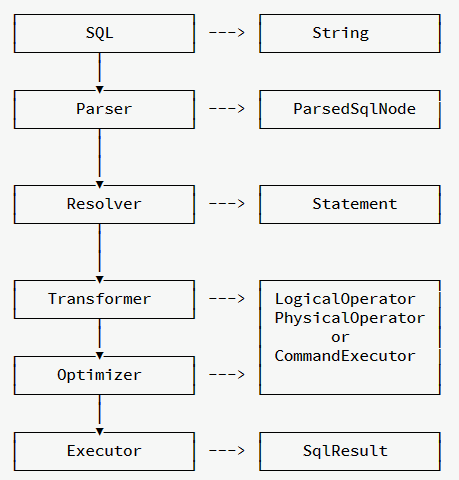
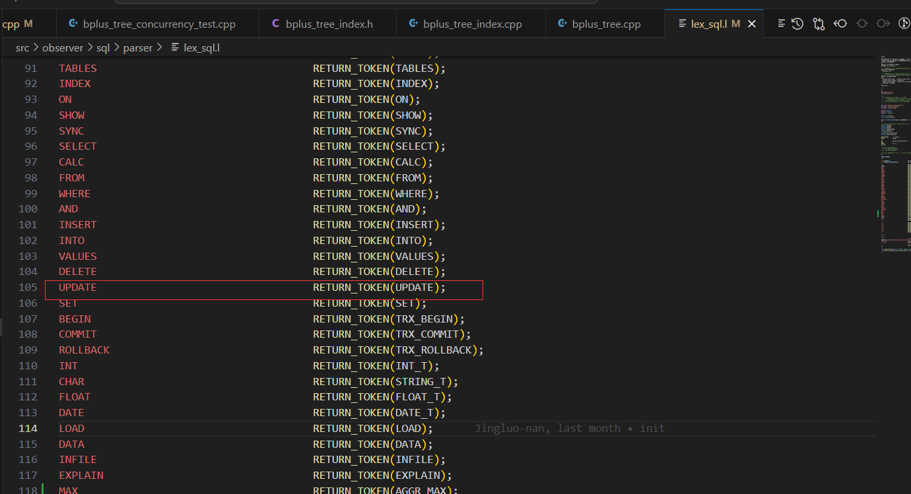
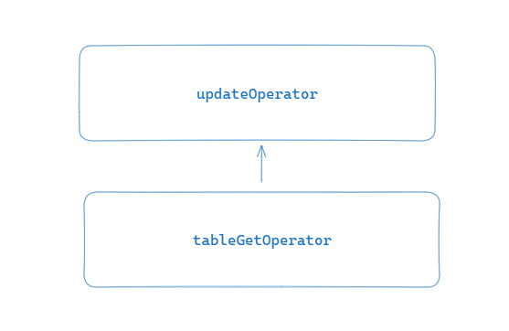
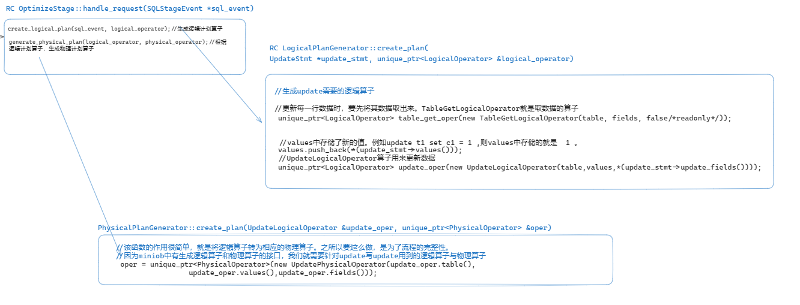
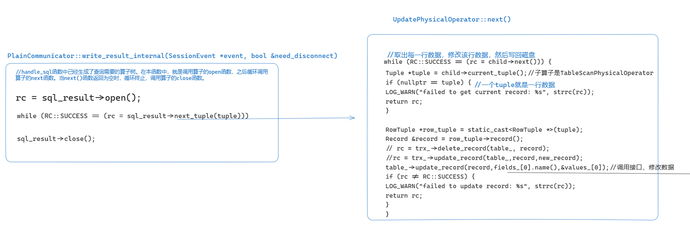
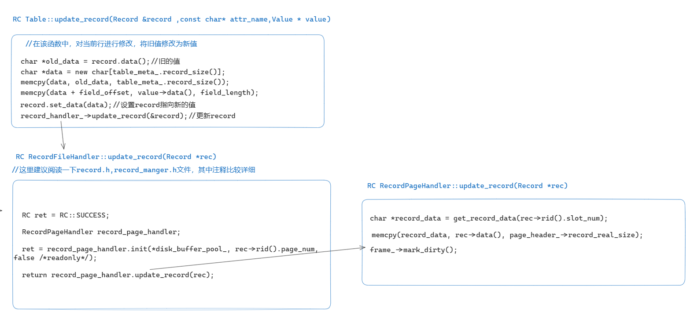

# Update语句执行流程解析

本文将会详细介绍miniob中update语句的执行流程，接下来将以`update t1 set c1 =1`为例进行讲解。

`create table t1 (c1 int);`

`insert into t1 values(2);`

`update t1 set c1 =1;`

#### 一.SQL语句执行流程

​	MiniOB的SQL语句执行流程如下图所示：


​

左侧是执行流程节点，右侧是各个执行节点输出的数据结构。

1. 我们收到了一个SQL请求，此请求以字符串形式存储;
2. 在Parser阶段将SQL字符串，通过词法解析(lex_sql.l)与语法解析(yacc_sql.y)解析成ParsedSqlNode(parse_defs.h);
3. 在Resolver阶段，将`ParsedSqlNode`转换成`Stmt`(全称 Statement， 参考 stmt.h);
4. 在Transformer和Optimizer阶段，将`Stmt`转换成`LogicalOperator`，优化后输出`PhysicalOperator`(参考 optimize_stage.cpp)。如果是命令执行类型的SQL请求，会创建对应的 `CommandExecutor`(参考 command_executor.cpp);
5. 最终执行阶段 Executor，工作量比较少，将PhysicalOperator(物理执行计划)转换为SqlResult(执行结果)，或者将`CommandExecutor`执行后通过SqlResult输出结果。

现在不明白这些过程没有关系，接下来会具体分析每一个过程。

#### 二.一条sql语句的一生

在阅读接下来的内容之前，建议大家先阅读一下链接的内容。

- https://oceanbase.github.io/miniob/miniob-introduction.html

我们学习一条sql的执行流程，可以从函数`SessionStage::handle_request(StageEvent *event)`看起，

```c++
void SessionStage::handle_request(StageEvent *event)
{
 	....
  (void)handle_sql(&sql_event);

	...
  RC rc = communicator->write_result(sev, need_disconnect);
    ...

}
```

在上述函数中，我们只需要关注以上两行代码。对于参数event，sql_event，我们可以简单的认为其代表当前执行的sql语句。

```c++
RC SessionStage::handle_sql(SQLStageEvent *sql_event)
{
  rc = parse_stage_.handle_request(sql_event);//词法语法解析
  rc = resolve_stage_.handle_request(sql_event);//根据词法语法解析生成的sqlNode，生成对应的stmt
  rc = optimize_stage_.handle_request(sql_event);//生成执行相关的算子
  rc = execute_stage_.handle_request(sql_event);

  return rc;
}
```

接下来会分别讲解以上四个函数。

#### 三.词法解析与语法解析阶段(Parser)阶段（parse_stage_.handle_request()）

​	词法分析与语法分析是编译原理中的相关知识，在miniob中，词法文件是lex_sql.l，语法文件是yacc_sql.y,下面是miniob官方给出的介绍词法语法分析的链接，建议先阅读后再继续学习本文档。

- ​	https://oceanbase.github.io/miniob/design/miniob-sql-parser.html


   在词法分析阶段，将输入的sql语句分解为一个个token。在语法分析阶段，根据语法文件，对词法分析生成的token进行规约，生成相应的`sqlnode`。下图中将`UPDATE`识别为token。
   
 
   
   
   针对`update t1 set c1 =1`这条sql，对应的是如下的语法规则(文件yacc_sql.y中)：

```.
update_stmt:      /*  update 语句的语法解析树*/
    UPDATE ID SET ID EQ value where 
    {
      $$ = new ParsedSqlNode(SCF_UPDATE);
      $$->update.relation_name = $2;
      $$->update.attribute_name = $4;
      $$->update.value = *$6;
      if ($7 != nullptr) {
        $$->update.conditions.swap(*$7);
        delete $7;
      }
      free($2);
      free($4);
    }
    ;
```
​	对于``update t1 set c1 =1``这条sql，以上语法规则中， `UPDATE` 对应于update，`ID`对应于`t1`，`SET`对应于`set`,`ID`对应于`c1`,`EQ`对应于`=`，`value`对应于 `1`.	

​	经过词法、语法解析后，update内容会存储到一个`UpdateSqlNode`对象中。

```c++
struct UpdateSqlNode
{
  std::string                   relation_name;         ///< Relation to update
  std::string                   attribute_name;        ///< 更新的字段，仅支持一个字段
  Value                         value;                 ///< 更新的值，仅支持一个字段
  std::vector<ConditionSqlNode> conditions;
};
```

​	对于`update t1 set c1 =1`这条sql，attribute_name中存储了列`c1`,relation_name表名`t1`，而conditions中存储的是where后的过滤条件，本sql中没有where子句，所以conditions中内容为空。

​	到此，词法语法解析的过程就结束了。

#### 四.resolve_stage_.handle_request（）函数

```c++
RC ResolveStage::handle_request(SQLStageEvent *sql_event)
{
	....

  ParsedSqlNode *sql_node = sql_event->sql_node().get();
  Stmt *stmt = nullptr;
  rc = Stmt::create_stmt(db, *sql_node, stmt);
	...

  sql_event->set_stmt(stmt);

  return rc;
}

```

该函数中，最重要的是`Stmt::create_stmt(db, *sql_node, stmt)`该函数根据词法语法解析生成的sqlNode，生成对应的stmt。

```c++
RC Stmt::create_stmt(Db *db, ParsedSqlNode &sql_node, Stmt *&stmt)
{
  stmt = nullptr;

  switch (sql_node.flag) {
    case SCF_INSERT: {
      return InsertStmt::create(db, sql_node.insertion, stmt);
    }
    case SCF_DELETE: {
      return DeleteStmt::create(db, sql_node.deletion, stmt);
    }
    case SCF_SELECT: {
      return SelectStmt::create(db, sql_node.selection, stmt);
    }
  	....
    default: {
      LOG_INFO("Command::type %d doesn't need to create statement.", sql_node.flag);
    } break;
  }
  return RC::UNIMPLENMENT;
}

```

sql_node.flag表示本语句的类型，针对update语句，会调用`UpdateStmt::create(db, sql_node.selection, stmt)`，根据sqlNode，生成stmt。**在此过程中，我们要检测update语句中出现的列名，表名等是否存在,以及新的值是否合法**，而在词法语法解析阶段，我们只能检查sql语句是否有语法错误。

```c++
RC UpdateStmt::create(Db *db, const UpdateSqlNode &update, Stmt *&stmt)
{
  const char *table_name = update.relation_name.c_str();
  if (nullptr == db || nullptr == table_name) {
    LOG_WARN("invalid argument. db=%p, table_name=%p",db, table_name);
    return RC::INVALID_ARGUMENT;
  }
  // check whether the table exists
  Table *table = db->find_table(table_name);
  if (nullptr == table) {
    LOG_WARN("no such table. db=%s, table_name=%s", db->name(), table_name);
    return RC::SCHEMA_TABLE_NOT_EXIST;
  }
  // check fields type
  // update t1 set c1 = 1;
  const TableMeta &table_meta = table->table_meta();
  const int sys_field_num = table_meta.sys_field_num();
   //1.检查 表t1 有没有c1 列
   //2.检查 c1 列的类型 与 1 是否匹配
  const std::vector<FieldMeta>* fieldMeta = table_meta.field_metas();
  bool valid = false;
  FieldMeta update_field;
  for ( FieldMeta field :*fieldMeta) {
    if( 0 == strcmp(field.name(),update.attribute_name.c_str()))
    {
      if(field.type() == update.value.attr_type())
      {
        valid = true;
        update_field = field;
        break;
      }
    }
  }


  std::unordered_map<std::string, Table *> table_map;
  table_map.insert(std::pair<std::string, Table *>(std::string(table_name), table));
  UpdateSqlNode  U = const_cast<UpdateSqlNode&>(update);
    // everything alright
  stmt = new UpdateStmt(table,&(U.value), 1,update_field,filter_stmt);
  return RC::SUCCESS;
}
```

到目前为止，我们已经将词法语法解析生成的`sqlNode`，转换为了`UpdateStmt`。

#### 五.optimize_stage_.handle_request()函数

```c++
RC OptimizeStage::handle_request(SQLStageEvent *sql_event)
{
  RC rc = create_logical_plan(sql_event, logical_operator);//生成逻辑算子
  rc = generate_physical_plan(logical_operator, physical_operator);//生成物理算子

  return rc;
}
```

该函数中，最重要的就是以上两行代码，什么是算子呢？**SQL 语句的具体执行过程，可以根据 SQL语句的不同分成不同的执行步骤，每个步骤中通常都会包含一个或多个SQL[算子](https://so.csdn.net/so/search?q=算子&spm=1001.2101.3001.7020)。**算子之间以树状形式进行组织。miniob中sql的引擎，采用火山模型。

在火山模型中，所有的代数运算符(operator)都被看成是一个迭代器，它们都提供一组简单的接口：open()—next()—close()，查询计划树由一个个这样的关系运算符组成，每一次的next()调用，运算符就返回一行(Row)，每一个运算符的next()都有自己的流控逻辑，数据通过运算符自上而下的next()嵌套调用而被动的进行拉取。




简单update语句的语法树如上图所示。tableGet算子负责将数据从磁盘中读出来，update算子负责修改数据并写回磁盘。

```c++
RC LogicalPlanGenerator::create_plan(
    UpdateStmt *update_stmt, unique_ptr<LogicalOperator> &logical_operator)
{
  Table *table = update_stmt->table();
  FilterStmt *filter_stmt = update_stmt->filter_stmt();
  std::vector<Field> fields;
  for (int i = table->table_meta().sys_field_num(); i < table->table_meta().field_num(); i++) {
    const FieldMeta *field_meta = table->table_meta().field(i);
    fields.push_back(Field(table, field_meta));
  }
  unique_ptr<LogicalOperator> table_get_oper(new TableGetLogicalOperator(table, fields, false/*readonly*/));

  std::vector<Value>values;
  values.push_back(*(update_stmt->values()));
  unique_ptr<LogicalOperator> update_oper(new UpdateLogicalOperator(table,values,*(update_stmt->update_fields())));

  update_oper->add_child(std::move(table_get_oper));//设置子节点

  logical_operator = std::move(update_oper);
  return rc;
}
```

算子之间通过`add_child`函数组织成树的形式。

而`generate_physical_plan`函数，就是将逻辑算子转换为物理算子。



#### 六.算子执行

经过以上的阶段，我们已经生成了sql语句相应的算子树，接下来就是对算子进行open(),next(),close()等操作。

首先调用顶层算子的open()函数，而在算子的open()函数中，还会递归的调用子算子的open()函数。同理，在算子的next()函数中，也会递归的调用子算子的next()函数。

```c++
RC SqlResult::open()
{
  if (nullptr == operator_) {
    return RC::INVALID_ARGUMENT;
  }

  Trx *trx = session_->current_trx();
  trx->start_if_need();
  return operator_->open(trx);//调用子算子的open函数
}
```

让我们回到最开始的时候:

```c++
void SessionStage::handle_request(StageEvent *event)
{
 	....
  (void)handle_sql(&sql_event);

	...
  RC rc = communicator->write_result(sev, need_disconnect);
    ...

}
```

`(void)handle_sql(&sql_event);`负责生成相应的算子树，`communicator->write_result`负责打开算子树，执行相应流程，获取查询结果并返回给客户端。

```c++
RC PlainCommunicator::write_result(SessionEvent *event, bool &need_disconnect)
{
  RC rc = write_result_internal(event, need_disconnect);
....
  return rc;
}
```

```c++
RC PlainCommunicator::write_result_internal(SessionEvent *event, bool &need_disconnect)
{
  RC rc = RC::SUCCESS;
  need_disconnect = true;

  SqlResult *sql_result = event->sql_result();
  rc = sql_result->open();//打开顶层算子
  if (OB_FAIL(rc)) {
    sql_result->close();
    sql_result->set_return_code(rc);
    return write_state(event, need_disconnect);
  }

  rc = RC::SUCCESS;
  Tuple *tuple = nullptr;
  while (RC::SUCCESS == (rc = sql_result->next_tuple(tuple))) {//调用顶层算子的next()函数
    assert(tuple != nullptr);

    ...
      Value value;
      rc = tuple->cell_at(i, value);//tuple就是一行数据
      if (rc != RC::SUCCESS) {
        sql_result->close();
        return rc;
      }

     ....
  if (rc == RC::RECORD_EOF) {//数据读取完毕
    rc = RC::SUCCESS;
  }

  RC rc_close = sql_result->close();//递归关闭算子
  if (OB_SUCC(rc)) {
    rc = rc_close;
  }

  return rc;
}
```






