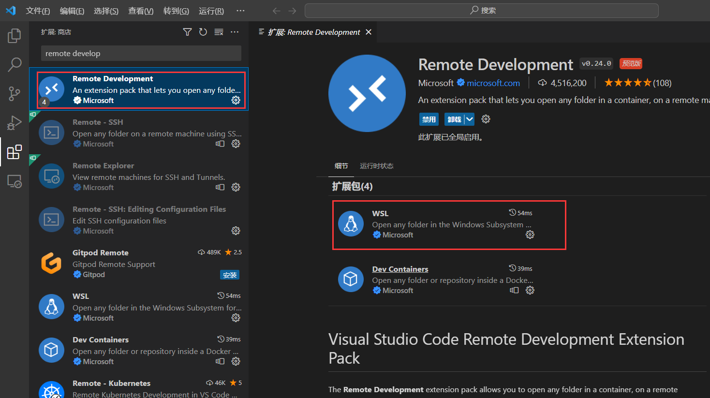
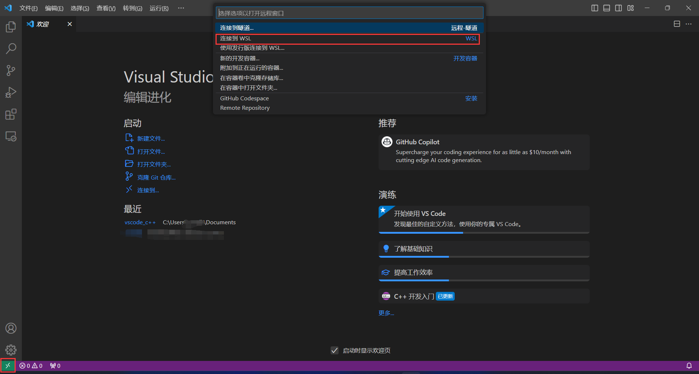
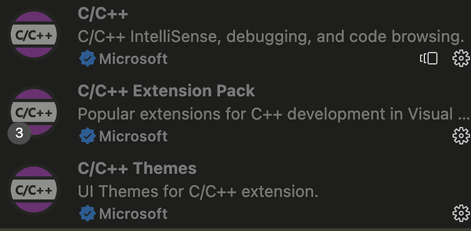
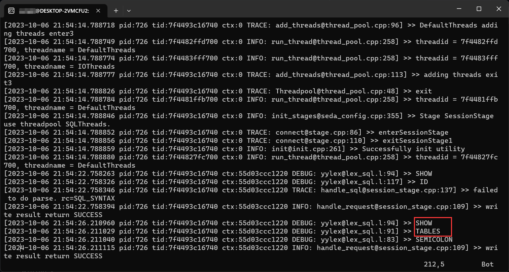

官方提供多种配置方式，可以采用docker等方式：[官方配置文档](https://oceanbase.github.io/miniob/dev-env/how_to_dev_in_docker_container_by_vscode.html)

这里为了方便起见，采用WSL(Linux环境) + vscode远程连接wsl进行开发的方式

# 环境配置

WSL是一个适用于Linux的Windows子系统，简单来说就是windows直接提供了一个Linux环境，不需要配置双系统和虚拟机等<br>

## WSL安装配置
- 参照[安装 WSL | Microsoft Learn](https://learn.microsoft.com/zh-cn/windows/wsl/install)
- 换源，ubuntu默认源下载起来可能会很慢，可以参考网上很多资料进行换源，比如[ubuntu | 镜像站使用帮助 | 清华大学开源软件镜像站 | Tsinghua Open Source Mirror](https://mirrors.tuna.tsinghua.edu.cn/help/ubuntu/)
- 注意在wsl下根据网络情况需要配置代理 <br>

## vscode安装配置
VSCode是一种简化且高效的代码编辑器，能够提供远程连接、代码调试、git版本控制等很多功能，接下来讲解vscode的配置与使用

1. 下载vscode    
[vscode下载地址](https://code.visualstudio.com/download)，vscode下载完毕后，可以配置为中文环境

2. 使用vscode远程连接本地wsl linux系统 
使用vscode远程连接服务器\本地wsl，需要安装Remote Development插件，这里需要安装扩展包下WSL才能连接成功  
   
   
  
重启vscode，点击左下角绿色连接，然后点击连接到WSL    



此时成功连接到WSL，选择打开文件夹，打开之前git clone下来的miniob文件夹，这时工作目录就位于miniob项目下了    


> 后续如果使用vscode git工具，前提是wsl中安装git
    
3. 配置C/C++开发环境

miniob是基于C/C++的项目，因此在这里我们配置vscode的C/C++开发插件，不仅提供语法高亮、代码补全的功能，还能够实现项目内跳转，大大提升开发效率

配置C/C++环境需要安装如下c++系列插件，同样是在vscode插件商店中下载，重启vscode即可   
 
    

> 注意c/c++插件如果只下载安装到本地是无法发挥出功能的，需要下载安装到wsl中，根据插件提示安装到wsl中即可    
    
# miniob项目编译安装

参考[官方编译运行手册](https://oceanbase.github.io/miniob/how_to_build.html)进行编译运行

```bash
# 非root用户
sudo apt install cmake git flex bison gdb gcc g++

# 你可能需要配置一下git代理
# git config --global https.proxy http://xxx.xxx.xxx.xxx:xxxx
# git config --global https.proxy https://xxx.xxx.xxx.xxx:xxxx
git clone xxxx

# 初始xxx
sudo bash build.sh init

# 编译
bash build.sh # 默认是debug，你也可以指定release xxxx

# 进入build目录下，运行
./bin/observer -f ../etc/observer.ini -P cli

# 以客户端\服务端命令运行
# 服务端
./bin/observer -f ../etc/observer.ini -p 6789
# 客户端
./bin/obclient -p 6789

# 日志信息位于build目录下observer.log中
# 数据目录位于build/miniob/db目录下
```
启动成功后，输入一条sql语句，可以查看服务端日志observer.log




总结一下，我们基于win+wsl进行miniob项目开发。vscode提供的作用是在windows环境下，能够连接到自己的wsl系统，并且能够借用vscode强大的插件高效开发项目


