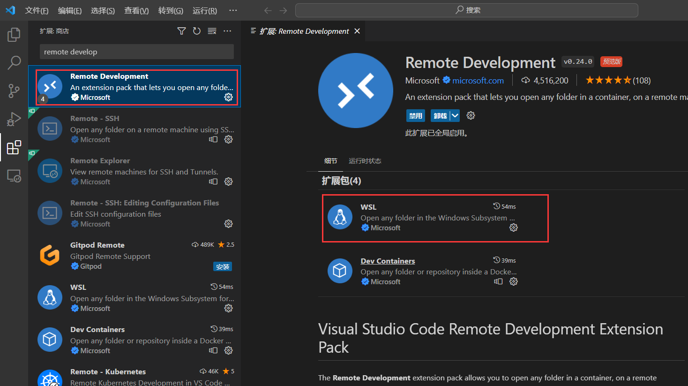
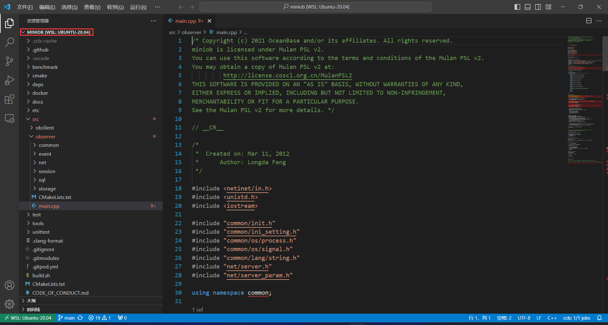
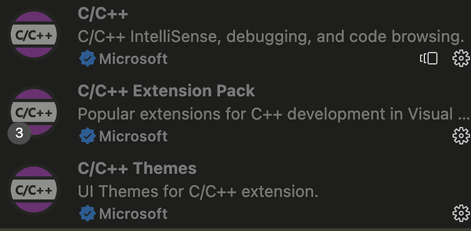
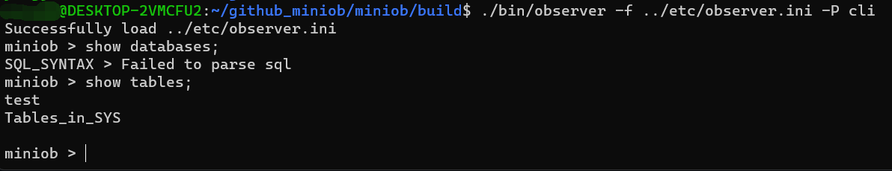
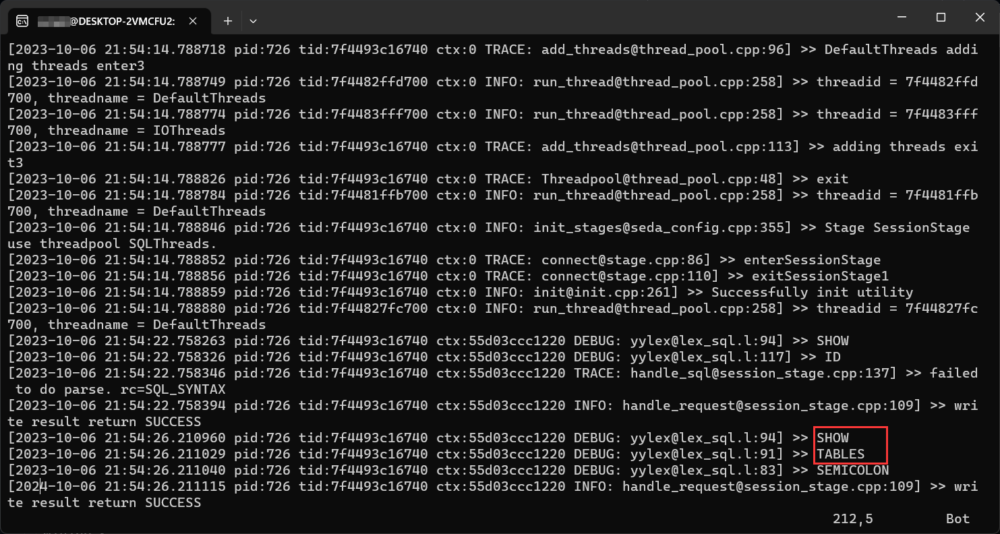

官方提供了多种搭建开发环境的方式，包括 GitPod, Docker 等，参见[开发环境配置](../dev-env/introduction.md)

对于使用 Windows 系统的同学，本文提供了 WSL + VSCode 进行开发的方式，作为对官方文档的补充

# 环境配置

WSL 是一个适用于 Linux 的 Windows 子系统，简单来说就是 Windows 直接提供了一个 Linux 环境，不需要配置双系统和虚拟机等

## WSL 安装配置
参考[安装 WSL | Microsoft Learn](https://learn.microsoft.com/zh-cn/windows/WSL/install)

安装后需要注意：
- 换源，Ubuntu 默认源下载起来可能会比较慢，参考[ubuntu | 镜像站使用帮助 | 清华大学开源软件镜像站 | Tsinghua Open Source Mirror](https://mirrors.tuna.tsinghua.edu.cn/help/ubuntu/)
- 在 WSL 下可能需要配置代理

## VSCode 安装配置
VSCode 是一种简化且高效的代码编辑器，能够提供远程连接、代码调试、Git 版本控制等很多功能，接下来讲解 VSCode 的配置与使用

1. 安装 VSCode
[VSCode 下载地址](https://code.visualstudio.com/download)，安装完毕后，可以配置为中文环境

2. 使用 VSCode 远程连接 WSL
使用 VSCode 远程连接服务器\本地 WSL，需要安装 Remote Development 插件，这里需要安装扩展包下 WSL 才能连接成功



重启 VSCode，点击左下角绿色连接，然后点击连接到 WSL


此时成功连接到 WSL，选择打开文件夹，打开`git clone`下来的 MiniOB 文件夹，这时工作目录就位于 MiniOB 项目下了



3. 配置 C/C++ 开发环境

MiniOb 是基于C/C++的项目，因此在这里我们配置 VSCode 的 C/C++ 开发插件，不仅提供语法高亮、代码补全的功能，还能够实现项目内跳转，大大提升开发效率

配置 C/C++ 环境需要安装如下 C++ 系列插件，同样是在 VSCode 插件商店中下载，重启 VSCode 即可



> 注意c/c++插件如果只下载安装到本地是无法发挥出功能的，需要下载安装到WSL中，根据插件提示安装到WSL中即可

# MiniOB 项目编译运行

参考[如何编译](../how_to_build.md)，[如何运行](../how_to_run.md)

```bash
sudo apt install cmake git flex bison gdb gcc g++

# 你可能需要配置一下git代理
# git config --global https.proxy xxxx
# git config --global https.proxy xxxx
# 推荐配置 ssh 免密
git clone xxxx

# 初始化
sudo bash build.sh init

# 编译
bash build.sh # 默认是 debug，你也可以指定 release

# 进入 build 目录下，运行
./bin/observer -f ../etc/observer.ini -P cli

# 以客户端\服务端方式运行
# 服务端
./bin/observer -f ../etc/observer.ini -p 6789
# 客户端
./bin/obclient -p 6789

# 日志信息位于 build 目录下 observer.log 中
# 数据目录位于 build/miniob/db 目录下
```

启动成功后，输入一条sql语句，可以查看服务端日志observer.log





总结一下，我们基于 Win+WSL 进行 MiniOB 项目开发。VSCode 提供的作用是在 Windows 上连接到 WSL，并且能够借用 VSCode 强大的插件高效开发项目
